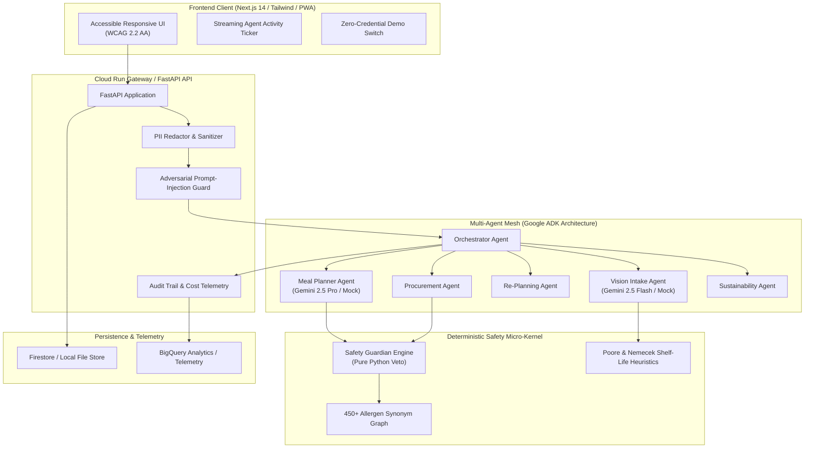
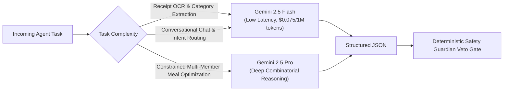

# PantryPilot Architecture & Multi-Agent Flow

## 1. High-Level System Architecture

```mermaid
graph TD
    subgraph Client["Frontend Client (Next.js 14 / Tailwind / PWA)"]
        UI["Accessible Responsive UI<br/>(WCAG 2.2 AA)"]
        Ticker["Streaming Agent Activity Ticker"]
        Banner["Zero-Credential Demo Switch"]
    end

    subgraph Gateway["Cloud Run Gateway / FastAPI API"]
        Main["FastAPI Application"]
        PII["PII Redactor & Sanitizer"]
        Guard["Adversarial Prompt-Injection Guard"]
        Audit["Audit Trail & Cost Telemetry"]
    end

    subgraph Agents["Multi-Agent Mesh (Google ADK Architecture)"]
        Orch["Orchestrator Agent"]
        Vision["Vision Intake Agent<br/>(Gemini 2.5 Flash / Mock)"]
        Planner["Meal Planner Agent<br/>(Gemini 2.5 Pro / Mock)"]
        Replan["Re-Planning Agent"]
        Proc["Procurement Agent"]
        Sust["Sustainability Agent"]
    end

    subgraph Safety["Deterministic Safety Micro-Kernel"]
        Guardian["Safety Guardian Engine<br/>(Pure Python Veto)"]
        Ontology["450+ Allergen Synonym Graph"]
        ShelfLife["Poore & Nemecek Shelf-Life Heuristics"]
    end

    subgraph Data["Persistence & Telemetry"]
        Store["Firestore / Local File Store"]
        BigQuery["BigQuery Analytics / Telemetry"]
    end

    UI --> Main
    Main --> PII
    PII --> Guard
    Guard --> Orch
    Orch --> Vision
    Orch --> Planner
    Orch --> Replan
    Orch --> Proc
    Orch --> Sust

    Planner --> Guardian
    Proc --> Guardian
    Guardian --> Ontology
    Vision --> ShelfLife

    Orch --> Audit
    Audit --> BigQuery
    Main --> Store
```

## 2. Dynamic Dual-Model Routing

```mermaid
flowchart LR
    Task["Incoming Agent Task"] --> Classifier{"Task Complexity"}
    Classifier -->|"Receipt OCR & Category Extraction"| Flash["Gemini 2.5 Flash<br/>(Low Latency, $0.075/1M tokens)"]
    Classifier -->|"Conversational Chat & Intent Routing"| Flash
    Classifier -->|"Constrained Multi-Member Meal Optimization"| Pro["Gemini 2.5 Pro<br/>(Deep Combinatorial Reasoning)"]
    
    Flash --> Output["Structured JSON"]
    Pro --> Output
    Output --> SafetyCheck["Deterministic Safety Guardian Veto Gate"]
```
